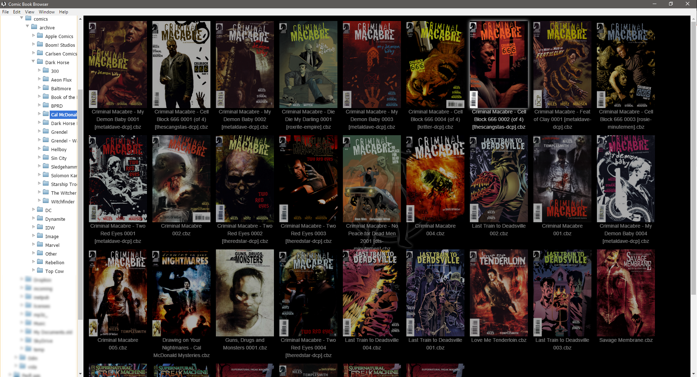

# cbr-manager
## Electron Comic Book Manager &amp; Reader

This is my first foray into Node.js and Electron. It's to be a recreation of an application I originally developed in C# DotNet that I require to become cross platform, hence my use of Electron.

The aim of the project is to display a file system folder browser that will then display large thumbnail images of the cover pages of any comic book files stored within.

Double clicking a comic book cover page will then launch the comic book reader. The comic book reader shows the pages from the comic book file using a responsive layout of either 1, 2 or 3 pages at a time. It also provides a thumbnail navigation at the bottom of the reader.

Page navigation is done using the mouse on the directional arrow buttons, using the mouse scroll wheel or PGUP, PGDN, Left Arrow, Right Arrow.

More details can be found in the Wiki [here](https://github.com/warlord0/cbr-manager/wiki)

## Requirements

7-zip v9.XX installed in your path as it must call the executable 7z (7z.exe in Windows) to extract CBZ/CB7 files for reading.
Also because 7-zip does not support newer RAR format files unrar (unrar.exe) is also required in the path.

## Screen Shots

### Main Browser Window

### Comic Book Reader with Thumb Navigation open

